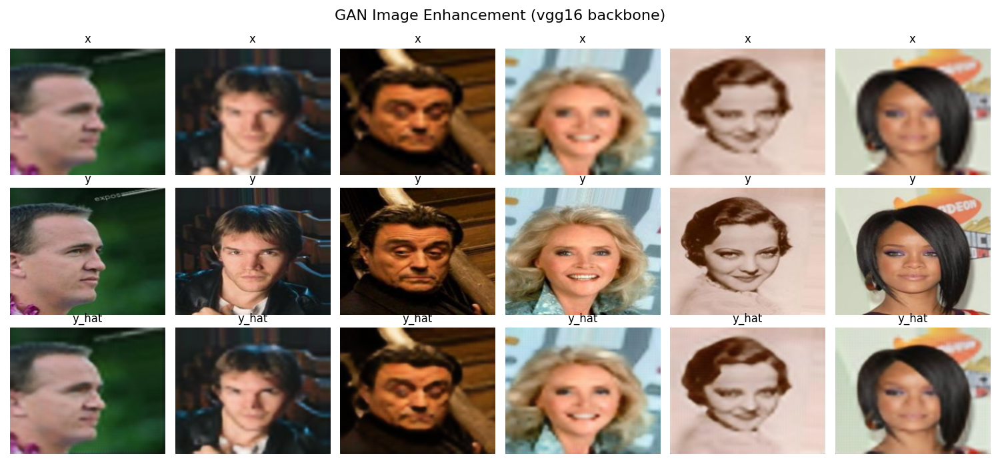

# CelebaEnhancement: Image Quality Enhacement using Generative Adversarial Networks

This project is created as part of the Neural Networks & Deep Learning course in Electrical and
Computer Engineering department of Aristotle University of Thessaloniki. Please refer to the
[report](GAN_Report_10453.pdf) for a methodology analysis. The developed code
in Python, along with detailed comments, can be found in the [source](source) module.

Generative Adversarial Networks (GANs) are a powerful machine learning approach designed
to generate new data samples that mimic a given dataset. In the context of image enhancement,
GANs aim to bridge the gap between low-quality inputs and their high-quality counterparts, addressing
challenges such as noise reduction, resolution improvement, and visual detail recovery.
Machine learning structures, particularly neural networks, are well-suited for this task because of its ability
to learn complex patterns and features from data, enabling GANs to generate realistic outputs
that were previously unattainable with traditional methods.

